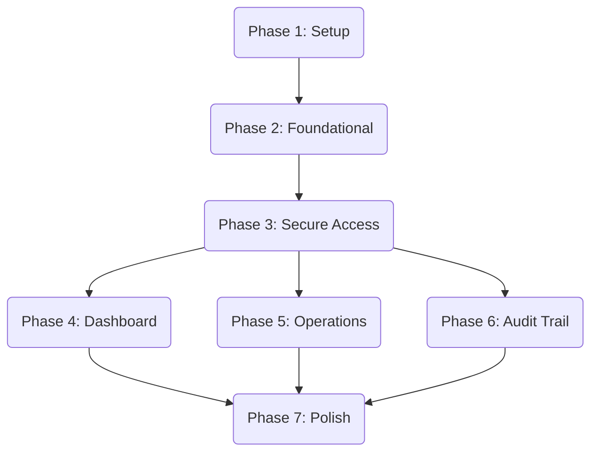

# Tasks: Create Intranet Portal

**Feature**: `001-create-intranet-portal`
**Spec**: [spec.md](./spec.md) | **Plan**: [plan.md](./plan.md)

## Summary

- **Total Tasks**: 28
- **MVP Scope**: Phases 1-4 (Setup through Dashboard)
- **Parallelism**: Frontend (Client) and Backend (BFF) tasks can often be parallelized once shared DTOs are defined.

## Dependencies

## Phase 1: Setup
*Goal: Initialize the solution structure and infrastructure configurations.*

- [x] T001 Create `Maliev.Intranet` solution and flat project structure (`Bff`, `Client`, `Shared`, `Tests`)
- [x] T002 Configure `nuget.config` with GitHub Packages credentials placeholder
- [x] T003 Setup `Maliev.Intranet.Bff/Dockerfile` with multi-stage build, exposing port `8080`, setting `ASPNETCORE_URLS=http://+:8080`, and health check path `/intranet/liveness`
- [x] T004 Add `Maliev.Aspire.ServiceDefaults` to BFF and map default endpoints
- [x] T005 Create `docker-compose` or `AppHost` using `redis:8.4-alpine` for local dev dependencies

## Phase 2: Foundational
*Goal: Establish shared kernels, authentication, and observability pipelines.*

- [x] T006 Implement shared DTOs in `Maliev.Intranet.Shared` (`UserContextDto`, `DownstreamResponse<T>`)
- [x] T007 Configure OpenTelemetry in BFF (`Program.cs`) and Client (via WASM interop)
- [x] T029 Configure `appsettings.json` with mandatory `LogLevel` block per platform guidelines (System=Warning, etc.)
- [x] T030 Implement business metrics (e.g., `intranet_active_users`) using OpenTelemetry meters in BFF
- [x] T008 [P] Setup SignalR Hub in BFF (`Hubs/NotificationHub.cs`) and Client connection logic
- [x] T009 Configure Authentication in BFF (IAM integration, JWT Bearer) and Client (BFF-based auth state provider)
- [x] T010 Create MainLayout in Client with navigation menu and login/logout links

## Phase 3: User Story 1 - Secure Access via IAM (P1)
*Goal: Enable secure login and identity verification.*
*Independent Test: User can log in and see their claims reflected in the UI.*

- [x] T011 [US1] Implement `AuthController` in BFF to handle login/logout/user-info proxying to IAM
- [x] T031 [US1] Configure Google OAuth2 in BFF (`Program.cs`) with domain restriction logic (Events.OnTicketReceived)
- [x] T012 [P] [US1] Create `CustomAuthenticationStateProvider` in Client to sync auth state with BFF
- [x] T013 [US1] Implement Login page with "Login with Google" button and standard credential form
- [x] T014 [US1] Verify JWT token validation and role extraction in BFF middleware

## Phase 4: User Story 2 - Role-Aware Operational Dashboard (P1)
*Goal: Display aggregated metrics and real-time alerts.*
*Independent Test: Dashboard loads data aggregated from mocks; updates via SignalR.*

- [x] T015 [US2] Define `DashboardViewModel` and `WidgetData` in `Shared`
- [x] T016 [US2] Implement `/api/dashboard` endpoint in BFF (Aggregating dummy/mock data initially)
- [x] T017 [P] [US2] Create Dashboard page in Client with Role-based widget rendering
- [x] T018 [US2] Implement SignalR broadcast for System Alerts in BFF and Client listener
- [x] T019 [US2] Connect BFF to actual downstream services (Customer, Order) via typed HttpClients (using WireMock for tests)

## Phase 5: User Story 3 - Unified Operational Management (P2)
*Goal: CRUD interfaces for Customers and Orders.*
*Independent Test: User can search/view customers and orders.*

- [x] T020 [US3] Define `CustomerSummaryDto` and `OrderSummaryDto` in `Shared`
- [x] T021 [US3] Implement `/api/customers` and `/api/orders` endpoints in BFF (Proxy to downstream)
- [x] T022 [P] [US3] Create `Customers.razor` page with search and data grid
- [x] T023 [P] [US3] Create `Orders.razor` page with status tracking view
- [x] T024 [US3] Implement Integration Tests for Customer/Order flows using Testcontainers

## Phase 6: User Story 4 - Transaction Audit Trail (P2)
*Goal: Ensure user identity is propagated to downstream services.*
*Independent Test: Downstream services receive `X-User-Id` headers.*

- [x] T025 [US4] Implement `UserContextHandler` delegating handler in BFF to attach identity headers to downstream requests
- [x] T026 [US4] Verify audit context propagation via integration tests (checking WireMock request headers)

## Phase 7: Polish & Cross-Cutting
*Goal: Production readiness and UX refinement.*

- [x] T027 Add global error handling (ErrorBoundary in Blazor, ExceptionMiddleware in BFF)
- [x] T028 Optimize WASM load size (trimming, lazy loading assemblies) and verify performance metrics
